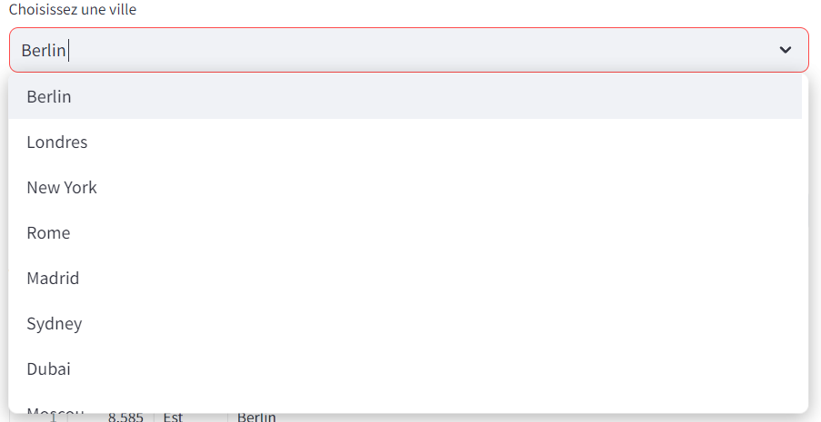
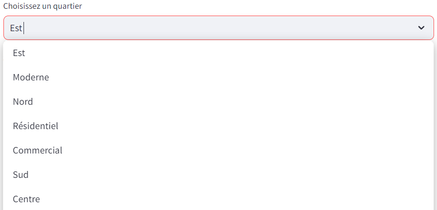
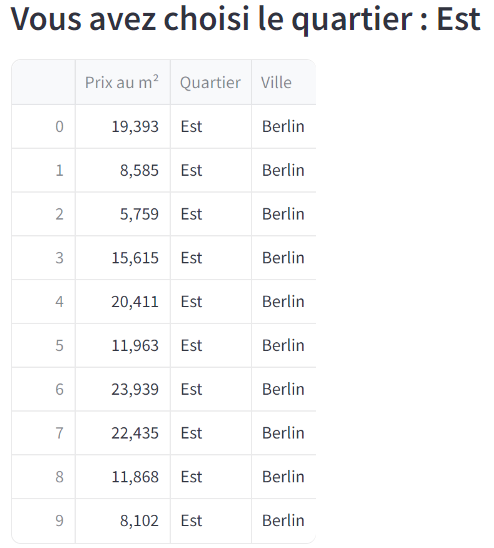
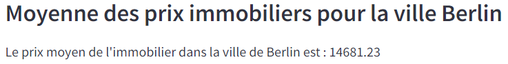

# Guide d'Utilisation de l'Application Streamlit pour la Recherche de Prix Immobilier par Ville et Quartier

Biennvenue dans le projet d'initiaiton à la recherche de Ladislas HEBRARD DE VEYRINAS et de Loïc ARNAL.

Veuillez suivre les instructions suivantes pour faire fonctionner le projet.

**En cas de problème, veuillez nous contacter immediatement sur nos addresses mails ISEN.**

## Lancement de l'application

- Lancer l'installation des dépendances : ``pip install -r requirements.txt``
- Lancer l'application : ``python app.py``
- lancer le webclient : ``run streamlit webclient.py``
- L'application devrait se lancer automatiquement.
- Lancer les tests unitaires : ``pytest`
- Il y a un script SQL pouvant être lancé dans une base de donnée mySQL mais il n'est pas relié au code par manque de temps.

## Utilisation de l'application :

### Choix de la Ville :
Utilisez le menu déroulant pour sélectionner la ville dont vous souhaitez consulter les prix immobiliers.

### Choix du Quartier :
Une fois la ville sélectionnée, utilisez le menu déroulant pour choisir le quartier spécifique dont vous souhaitez consulter les prix immobiliers.

### Affichage des Prix Immobiliers pour le Quartier Sélectionné :
L'interface affichera les prix immobiliers pour le quartier choisi.

### Affichage de la Moyenne des Prix Immobiliers pour la Ville Sélectionnée :
Après avoir sélectionné une ville, l'interface affichera la moyenne des prix immobiliers pour cette ville.

## Remarques :
Les données utilisées dans cette application sont obtenues à partir d'une API locale accessible à l'adresse : [http://127.0.0.1:5000](http://127.0.0.1:5000).

### Auteurs : Ladislas HEBRARD DE VEYRINAS & Loïc ARNAL